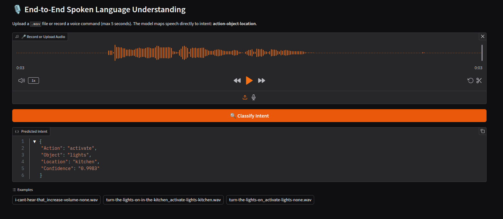

# End-to-End Spoken Language Understanding

This project demonstrates a lightweight, end-to-end spoken language understanding system using a transformer-based model that maps speech directly to intent, eliminating the need for complex ASR + NLP/LLM pipelines.

The model is trained on the [fluent-speech-commands dataset](https://arxiv.org/pdf/1904.03670) to interpret voice commands in the format _"action-object-location"_ (e.g., "turn on the lights in the kitchen"). It serves as a proof-of-concept for building lightweight voice interfaces that can be deployed on resource-constrained devices.



## Use Cases

- **Domain-Specific Voice Control**: No transcription errors, ideal for fixed command sets with unique phrases
- **Smart Home Devices**: Voice-controlled lights, thermostats, appliances
- **IoT Applications**: Resource-constrained embedded systems
- **Mobile Apps**: Offline voice command recognition

## Key Features

- **Single Lightweight Transformer Model**: ~1M parameters
- **End-to-End Pipeline**: From audio input to structured command output
- **Efficient Feature Extraction**: Mel-spectrogram with frame stacking
- **Easy Training**: Simple training pipeline with validation and evaluation

## Project Structure

```
slu/
├── app.py                     # Gradio web UI for inference testing
├── model.py                   # SLU Transformer model definition
├── benchmark.py               # Script for benchmarking model inference speed
├── dataset.py                 # Dataset loading and preprocessing
├── utils.py                   # Audio processing and utility functions
├── train.py                   # Training script
├── inference.py               # Command line inference script
├── eval.py                    # Model evaluation and checkpoint analysis
├── confusion_matrix.py        # Confusion matrix visualization
├── EP_81_SLU_Transformer.pth  # Pre-trained checkpoint (95.8% on test set)
├── LICENSE                    # Apache 2.0 license
├── requirements.txt           # Python packages
├── generate_examples.sh       # Copies example audio files for the Gradio app
```

## Architecture

### Model

The core model uses a transformer architecture:

- **Input**: Mel spectrogram features (320-dimensional)
- **Encoder**: 5-layer transformer encoder with 4 attention heads
- **Output**: Classification over 31 command classes
- **Parameters**: ~1M total parameters

There is no decoder in this model.  Instead, a fully connected feedforward neural network followed by a softmax layer classifies the audio signal.

### Feature Extraction

1. **Audio Loading**: 16kHz mono audio input
2. **Mel Spectrogram**: 80 mel-frequency bins with 25ms window, 10ms hop
3. **Frame Stacking**: 4 frames with skip rate of 3 (320-dimensional features)
4. **Normalization**: Per-feature standardization

## Model Performance

The [included pre-trained model](./EP_81_SLU_Transformer.pth) achieves:
- **Test Accuracy**: >95% on FSC test split without pre-training
- **Inference Speed**: ~1ms per 2-second command on GPU
- **Memory Usage**: ~7MB model size

## Installation

### Prerequisites

- Python 3.12+
- CUDA 12.2+ for GPU training and inference

### Setup

1. Clone the repository
    ```bash
    git clone https://github.com/c-jg/slu.git
    cd slu
    ```

2. Create a virtual environment and install dependencies
    ```bash
    python -m venv venv
    source venv/bin/activate
    pip install -r requirements,txt
    ```

    > Follow the instructions in [PyTorch's docs](https://pytorch.org/get-started/locally/) to correctly install `torch` based on your GPU.

## Usage

### Training

Train the model on the [fluent-speech-commands dataset](https://arxiv.org/pdf/1904.03670):

```bash
python train.py \
    --output_path ./checkpoints \
    --dataset_base_dir /path/to/fluent_speech_commands \
    --epochs 100 \
    --lr 0.0001 \
    --batch_size 32 \
    --num_workers 4
```

**Parameters:**
- `--output_path`: Directory to save model checkpoints
- `--dataset_base_dir`: Path to Fluent Speech Commands dataset
- `--epochs`: Number of training epochs
- `--lr`: Learning rate
- `--batch_size`: Batch size for training
- `--num_workers`: Number of data loading workers

### Inference

Run inference on a single audio file:

```bash
python inference.py \
    --wav /path/to/audio.wav \
    --model EP_81_SLU_Transformer.pth \
    --train_csv /path/to/train_data.csv
```
**Parameters:**

- `--wav`: Path to the mono 16kHz WAV file to be classified.
- `--model`: Path to a trained model checkpoint file (e.g., `EP_81_SLU_Transformer.pth`).
- `--train_csv`: Path to the `train_data.csv` file from the Fluent Speech Commands dataset. This is used to reconstruct the label mapping (i.e., which class index corresponds to which action-object-location command).

**Example Output:**
```json
{
    "action": "turn on",
    "object": "lights", 
    "location": "kitchen"
}
```

### Web Application

Run `app.py` to launch the Gradio graphical interface in a browser.  You can upload a wav file to classify it, or record directly from your microphone.

> **NOTE:** Before launching, download the FSC dataset and extract it to `fluent_speech_commands_dataset/` in the project root.  Then run [`generate_examples.sh`](generate_examples.sh) to populate the examples used in the Gradio web app. 

### Evaluation

Evaluate model performance on test set:

```bash
python eval.py \
    --checkpoints_dir ./checkpoints \
    --dataset_base_dir /path/to/fluent_speech_commands \
    --output_path ./eval_results
```

This generates performance metrics for all the checkpoints in a directory on the test set.

### Benchmarking

Benchmark model inference speed:

```bash
python benchmark.py \
    --model EP_81_SLU_Transformer.pth \
    --num_runs 1000 \
    --num_classes 31
```

This script measures the average time per prediction on a 2-second audio signal.  On modern consumer grade Nvidia GPUs (RTX 30 series or newer) the model inference should be ~1ms or faster.  The inference speed of 1ms mentioned above is with an RTX 3060.  `benchmark.py` only measures inference speed of the compiled PyTorch model, not the feature extraction or post-processing.

**Parameters:**
- `--model`: Path to the trained model checkpoint (default: EP_81_SLU_Transformer.pth)
- `--num_runs`: Number of inference runs for averaging (default: 1000)
- `--num_classes`: Number of classes the model was trained on (default: 31)

## Dataset

This project is designed to work with the [Fluent Speech Commands](https://arxiv.org/pdf/1904.03670) dataset, which contains:

- **31 unique commands** in _action-object-location_ format
- **30,000+ audio samples** from 97 speakers
- **Diverse acoustic conditions** (noise, different rooms, etc.)

| Split | # of speakers | # of utterances | # hours |
|-------|---------------|-----------------|---------|
| Train | 77            | 23,132          | 14.7    |
| Valid | 10            | 3,118           | 1.9     |
| Test  | 10            | 3,793           | 2.4     |
| **Total** | **97**    | **30,043**      | **19.0**|

### Dataset Structure

```
fluent_speech_commands/
├── Fluent Speech Commands Public License.pdf
├── readme.md
├── data/
│   ├── train_data.csv
│   ├── valid_data.csv
│   └── test_data.csv
└── wavs/
    └── speakers/
        └── [speaker_ids]/
            └── [audio_files].wav
```

## Customization

### Adding New Commands

The simplest way to train on a new vocabulary is to keep the same dataset structure as the FSC dataset.

1. **Update Dataset**: Add new audio samples to your dataset per speaker in `wavs/speakers`
2. **Update CSV Files**:  
   - Add new rows to `data/train_data.csv`, `data/valid_data.csv`, and `data/test_data.csv` to reference your new audio files and their corresponding labels.  
   - Each row should follow the format:  
     ```
     ,path,speakerId,transcription,action,object,location
     ```
     For example:  
     ```
     wavs/speakers/NEW_SPEAKER_ID/your_new_file.wav,NEW_SPEAKER_ID,Turn on the fan,activate,fan,none
     ```

2. **Retrain Model**: Run `train.py` on updated dataset.

### Model Architecture

Modify `model.py` to experiment with:
- Different transformer depths (`num_layers`)
- Attention head counts (`nhead`)
- Hidden dimensions (`d_model`)
- Additional layers or attention mechanisms

The default model parameters are based on the research in [End-to-end neural transformer based spoken language understanding](https://www.amazon.science/publications/end-to-end-neural-transformer-based-spoken-language-understanding).


### Feature Extraction

Customize `utils.py` to experiment with:
- Different mel spectrogram parameters
- Alternative feature extraction methods
- Custom normalization strategies

### Training Loop

Customize `train.py` to experiment with:
- **Learning rate scheduling**: Adjust `lr`, `min_lr`, and `ReduceLROnPlateau` parameters (e.g., `factor`, `patience`) to control convergence and prevent overfitting.
- **Optimizer settings**: Modify `weight_decay` for L2 regularization or switch optimizers.
- **Batch size**: Tune `batch_size` to balance training speed and memory usage.
- **Number of epochs**: Set `epochs` to control duration of training.
- **Data loading**: Adjust `num_workers` for optimal data loading speed.
- **Dropout**: Add or tune dropout rates in the model for better generalization (controlled via `model.py`).

## Contributing

1. Fork the repository
2. Create a feature branch
3. Make your changes
4. Submit a pull request

## License

[Apache 2.0 license](https://www.apache.org/licenses/LICENSE-2.0)

## Acknowledgments

- [Fluent Speech Commands dataset](https://arxiv.org/pdf/1904.03670)
- [End-to-end neural transformer based spoken language understanding](https://www.amazon.science/publications/end-to-end-neural-transformer-based-spoken-language-understanding)
